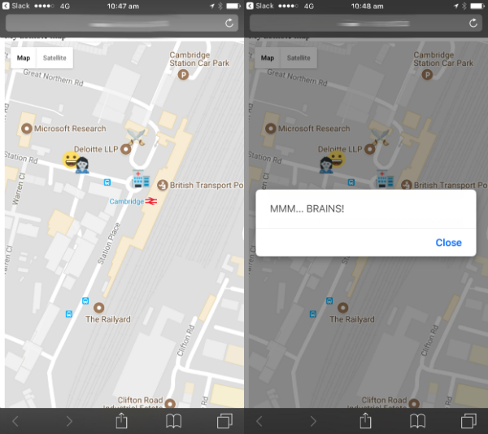

## Introduction

Use the GPS on your phone to make an outdoor zombie apocalypse game you can play with your friends. Collect the supplies to power up, but avoid the zombies!

### What you will make

You will make a game that you can play outside using your mobile phone's GPS capabilities. Find the power-ups and avoid the zombies!

### What you will learn

This project covers elements from the following strands of the [Raspberry Pi Digital Making Curriculum](http://rpf.io/curriculum):

+ [Design basic 2D and 3D assets](https://curriculum.raspberrypi.org/design/creator/)
+ [Apply abstraction and decomposition to solve more complex problems](https://curriculum.raspberrypi.org/programming/developer/)
+ [Engage and share with the digital making community](https://curriculum.raspberrypi.org/community-and-sharing/creator/)
