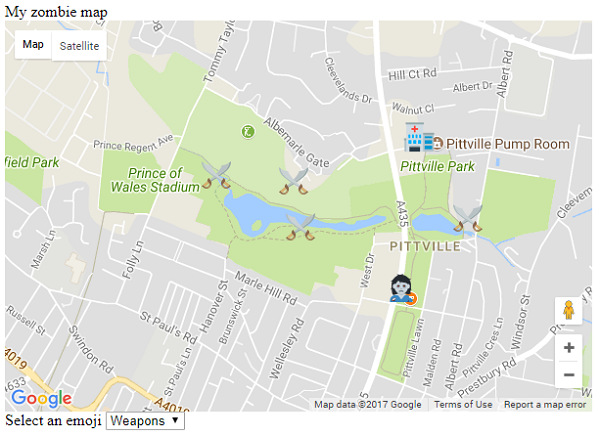

## Add points of interest

+ You can decide where your points of interest will be by creating a [Zombie apocalypse survival map](https://projects.raspberrypi.org/en/projects/zombie-apocalypse-map). Here is an example map we created for a zombie game in the local park, and the data for this map which was copied from the **console**.



```html
51.90769026213801 -2.068905830383301 zombie.png
51.91174087287536 -2.0681333541870117 hospital.png
51.91054955470073 -2.0736265182495117 weapons.png
51.909305255309874 -2.0733261108398438 weapons.png
51.91070839895001 -2.077016830444336 weapons.png
51.90954352807475 -2.0659875869750977 weapons.png
```

+ You will also need to copy the emoji files you used when creating the map and paste them into the same directory as the `index.html` file for your Where's Zombie game. We used these emojis but you may have chosen different ones on your map.
  

+ Locate the line of code `var zombie_map;`. Underneath it, on a blank line, create a new variable called `data` and set it equal to the data you copied from the console. Pasting in your data might make your editor complain and highlight the lines of code in a strange way, so put a backtick (\`) at the start and the end of the data to tell JavaScript it is a string which is split over multiple lines.

+ We want to handle each marker separately, so let's add some code on the following line to split up the data into separate lines. Each individual line is data for one marker, so we will split the data whenever there is a `\n` which is an invisible newline character.

```JavaScript
var markers = data.split("\n");
```

We end up with an **array** of markers.

+ Now position your cursor inside the `initMap()` function, just after the code for creating the zombie map.


+ Create a **for loop** that will run once for every marker in the `markers` array we just created.

[[[generic-javascript-for-loop]]]
