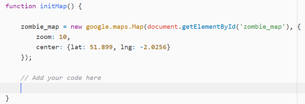

## Creating markers

+ Position your cursor inside the `initMap()` function, just after the code for creating the zombie map.



+ Create a **for loop** that will run once for every marker in the `markers` array we just created.

[[[generic-javascript-for-loop]]]

+ Inside the **for loop** we will be able to access each line of marker data as `markers[i]` - the loop will add one to the variable `i` each time it runs, so we will be looking at each line of data, one by one.

For example, our first line of data is as follows

```html
51.90769026213801 -2.068905830383301 zombie.png
```

We want to end up with this data as an array...

```JavaScript
marker_data = [51.90769026213801, -2.068905830383301, "zombie.png"]
```

...but we'd like JavaScript to do this automatically for us.

Firstly, `trim()` any stray spaces from the beginning and end of the data, because we are going to split it up into individual parts wherever a space is detected. Then add this line of code inside your **for loop**.

```JavaScript
var marker_data = markers[i].trim().split(" ");
```
+ To be able to add the marker at the correct position, you need to create a `LatLng` object.

```JavaScript
var marker_position = new google.maps.LatLng(marker_data[0], ###);
```

The **latitude** value is the first item in the `marker_data` array, but since the numbering of items in the array starts at 0 we have to refer to it as `marker_data[0]` and NOT `marker_data[1]`.

Add this line of code immediately underneath the previous line, replacing `###` with the **longitude** value from the `marker_data` array. Remember that the latitude value was `marker_data[0]` - can you work out what this should be?

+ Still inside the loop, write some code to create a marker at the `marker_position`, with the `icon:` as the specified emoji.

[[[generic-api-google-maps-marker]]]

--- hints ---
--- hint ---
Instead of putting in a fixed latitude/longitude like in the example, use the `marker_position` variable to tell the marker where it should be placed.
--- /hint ---

--- hint ---
Check that the name of the map (in the example `mymap`) has the same name as the map you have created.
--- /hint ---

--- hint ---
You can add an icon by adding another line within the marker to specify `icon: "nameofpicture.png"`. Don't forget to put a comma at the end of the map line to say that there is another marker property you would like to set.
--- /hint ---

--- hint ---
If you specify a fixed filename like `"nameofpicture.png"` then the marker icon will always be the same. Which number item in the `marker_data` array contains the picture for each piece of data? Don't forget that we start counting in the array at 0, so the first item in the array (the latitude) is `marker_data[0]`.
--- /hint ---


--- /hints ---


+ Save your code and refresh the page. Test that all of your markers show up properly on the map. If they do not show up properly, perhaps you could look in the JavaScript **console** to see if there are any error messages for you to resolve?

[[[generic-javascript-opening-console]]]
