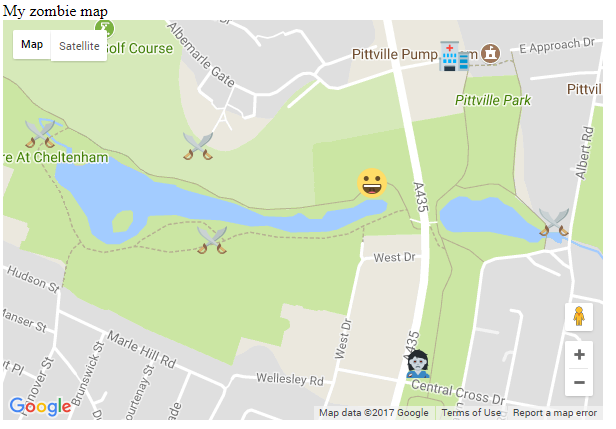

## Display your current position

Let's display the player's current position on the map.

+ Inside the `initMap()` function, after you create the map, add some code to use HTML5 geolocation to find the player's current position:

```javascript
if(navigator.geolocation) {
    navigator.geolocation.watchPosition(set_my_position);
}
else {
    alert("Geolocation doesn't work in your browser");
}
```

This code checks whether the geolocation can be found using the web browser, and if it cannot be found, a popup box will appear with a message. If it can, we set up code to `watchPosition` - this will constantly monitor the position of the device and will call the function `set_my_position` whenever the position of the device changes.

+ To be able to display the player's position on the map, we need to write the `set_my_position` function. After the closing bracket of the `initMap()` function, create a new function called `set_my_position`.

[[[generic-javascript-create-a-function]]]

+ This function is automatically passed the current latitude and longitude by the `watchPosition` we set up, so add an **argument** in the brackets called `position` so we can use this data.

`function set_my_position(position){`

+ The latitude can be found within the function as `position.coords.latitude` and the longitude as `position.coords.longitude`. Following the same method as you did in the previous step, create a LatLng object called `pos` inside the `set_my_position` function. The object should contain these latitude and longitude values.

```JavaScript
var pos = new google.maps.LatLng(###, ###);
```

+ Still inside the function, create a marker which is situated at the LatLng object's position. You should choose a different icon for this marker - we chose to represent the player as a smiley face but you can choose any emoji you like. Don't forget to copy and paste the emoji image file into the same folder as your `index.html` code. 

+ Save your code and refresh the internet browser. If your internet browser pops up a warning asking whether it can use your location data, press "Allow". You should see your player emoji appear wherever you currently are - the location should be pretty accurate.



+ You might want to adjust the `zoom` value in your map at this stage if it is a little too far out to see the locations of the icons clearly. A larger value means the map will be further zoomed in.
