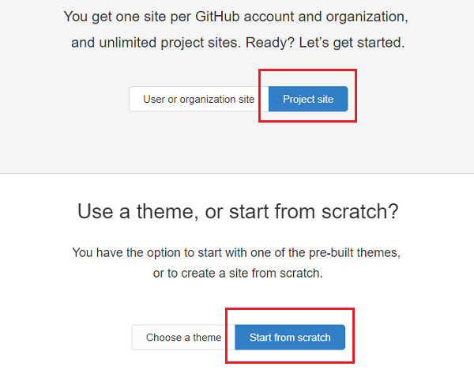
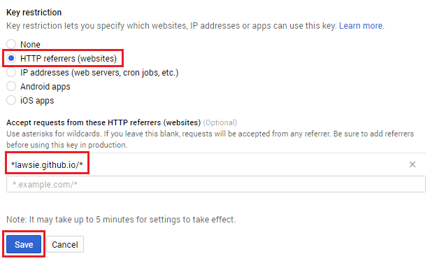

## Testing the GPS

You probably want to test whether your player icon moves around as you move around, but to do this you'll need to go outside. This could be pretty inconvenient while holding a computer, so let's upload the web page to the internet so that you can access it on your phone!

### Important safety notes
Don't forget that when you upload things onto the internet, anyone can see them. If you've centered the map on the latitude and longitude of your house, anyone who accesses the webpage can see exactly where you live. It is safer to set up your zombie map in a communal area such as a park or a town centre so that you are not giving away your own personal data.

For the GPS to work, you will need to enable the location services on your phone - be aware that this means that your phone is tracking your exact position. It is never a good idea to post your exact location in public on the internet, so to be safe, turn this setting off after you have played the zombie game to make sure no other apps can use it. Your location will only be used by the zombie game in the web page you have created - so you know exactly what this code does, because you wrote it!

### Upload your code
You can upload your zombie game onto any service that offers web hosting. You may already have some hosting available to you, if so then feel free to use that. We chose to use [GitHub pages](https://pages.github.com/) because it is trustworthy and easy to use. To use it, follow these steps:

+ Sign up for a [GitHub account](https://github.com/join)

+ Visit the [instructions page](https://pages.github.com/) and click on **Project site** and **Start from scratch**

+ Follow the instructions to create an index file as described, and instead of typing `<h1>Hello</h1>`, paste in the code from your `index.html` file before committing it.

+ You will also need to click on the **Upload files** button and upload the emoji files you are using

+ Finally, follow step 4 on the instructions page to set up your master branch as a GitHub pages site, and then view your page by typing in the address into a browser.

## Restrict your API key
Now that you have put your code online, your Google Maps API key is visible to everyone. Someone could take it and use it without your permission. You can stop this from happening by restricting where it can be used, so that it can only be used on your website.

+ Head back over to the [Google APIs console](https://console.developers.google.com/flows/enableapi?apiid=picker&credential=client_key) and click on **Select a project** on the top left

+ Select the project you made when you set up your API key. This might still be called **My project** if you didn't change it.

+ Click on **Credentials** on the left, then click on your API key

+ Under **Key restriction**, select **HTTP referrers** and in the box, add the base URL of your website, with a `*` at each end. For example, my code was hosted at `http://lawsie.github.io/` so I put `*lawsie.github.io/*`. Press save.

+ Your key should now only work on your website, and not anywhere else. Note that if you now try to look at the map on your computer, it will not work because the request is not coming from your website. You might want to create an extra API key that is unrestricted, and ONLY use that key on your private computer for testing. 
