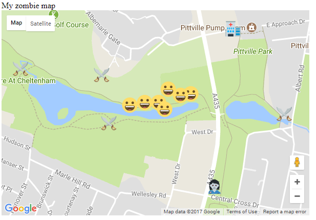

## Attack of the smileys

When you tested your map on your phone, you probably thought you were being attacked by smileys rather than zombies! This is because the page creates a brand new marker every time the player moves, but doesn't remove the marker from their old position. Eventually this gets really confusing because you can't tell where you are from where you've been!



+ Locate the line `var zombie_map;` and underneath it add a new variable called `old_position`.

+ Inside the `initMap()` function, create a marker called `old_position` and initialise it to the same location you initialised your map to originally. It actually doesn't matter what location this marker is initialised at, as its location value will be overwritten almost immediately, but it does need to be initialised.

+ Locate your function `set_my_position()`. Add a line of code so that the **first** thing you do in the function is to remove the old position marker:

```JavaScript
old_position.setMap(null);
```

+ Add another line of code but this time as the **last** thing you do in the function. This saves the new position marker you just created as the `old_position` so that next time when we create a new marker we know where the previous one was.

```JavaScript
old_position = marker;
```

+ Save your code and upload it again to your web hosting. Test the code out by walking around and you should see your player smiley move around but this time there will be no trail of smileys, only one to show your current position. Phew.
