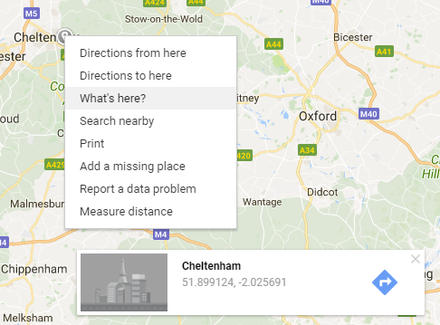

## नक्शा बनाएं

यदि आप [Zombie apocalypse survival map](https://projects.raspberrypi.org/en/projects/zombie-apocalypse-map){:target="_blank"} प्रोजेक्ट को पूरा कर चुके है, तो आप देखेंगे की इस प्रोजेक्ट के पहले के कुछ चरण काफी समान है। **सुनिश्चित करें कि आपने अपने पुराने कोड का पुन: उपयोग करने के बजाय इस प्रोजेक्ट के लिए एक नई HTML फ़ाइल शुरू की है।** अन्यथा आप बाद के चरणों के दौरान भ्रमित हो जाएंगे।

+ `index.html` नामक फ़ाइल बनाएँ और सेव (save) करें। ऐसा करने के लिए आपको ऑनलाइन HTML टेक्स्ट एडिटर के बजाय अपने कंप्यूटर पर एक टेक्स्ट एडिटर का उपयोग करना होगा।

[[[generic-html-create-and-save]]]

+ फ़ाइल में, एक मूल (basic) HTML पेज बनाने के लिए टैग जोड़ें।

[[[generic-html-basic-page]]]

+ यदि आपके पास पहले से एक नहीं है, तो Google Maps JavaScript API key प्राप्त करें। सुनिश्चित करें कि आप अपने `index.html` फ़ाइल को कोड जोड़ रहे हैं, key को इस्तेमाल करके।

[[[generic-api-google-maps-key]]]

+ Text editor में `<head>` टैग(tag) को अपने कोड में ढूंढ़े। इस टैग के नीचे एक खाली रेखा पर, यह निर्धारित करने के लिए कि आपका नक्शा कितना बड़ा होगा और यह ठीक से लोड नहीं होने पर किस रंग को प्रदर्शित किया जाएगा, निम्न कोड जोड़ें।

```html
<style>
#zombie_map {
    height: 100%;
    width: 100%;
    left: 0;
    position: absolute;
    top: 0;  
    background-color: grey;
}
</style>
```

+ अपने कोड में `<body>` टैग ढूंढें। इस टैग के नीचे एक खाली रेखा पर, `<div>`(एक अदृश्य बॉक्स) बनाने के लिए निम्नलिखित कोड जोड़ें जहां आपका नक्शा अंततः दिखाई देगा।

```html
मेरा ज़ोंबी नक्शा (Zombie Map)
<div id="zombie_map"></div>
```

+ [Google Maps](http://maps.google.com){:target="_blank"} पर एक शहर का पता लगाएं, फ़िर नक्शे पर राइट क्लिक (right-click) करे और **What's here?** चुने। पेज के नीचे एक बॉक्स खुलेगा(pop-up) जो अक्षांश और देशांतर (latitude and longitude) दिखाएगा।



+ आपके द्वारा अभी जोड़े गए `<div>` कोड के ठीक नीचे, नक्शा बनाने के लिए निम्नलिखित कोड जोड़ें। `###` को अक्षांश और देशांतर (latitude and longitude) मूल्यों के साथ बदले जो आपने अभी-अभी अपने शहर के लिए देखे थे।

```html
<script>
    var zombie_map;
    function initMap() {

            zombie_map = new google.maps.Map(document.getElementById('zombie_map'), {
            zoom: 10,
            center: {lat: ###, lng: ###}
        });
    }
</script>
```

+ अपना कोड सेव (save) करें और अपने इंटरनेट ब्राउज़र को रिफ्रेश (Refresh) करें। आपको उस शहर के साथ एक Google Map दिखना चाहिए जिसे आपने नक्शे के बीच में चुना था।

