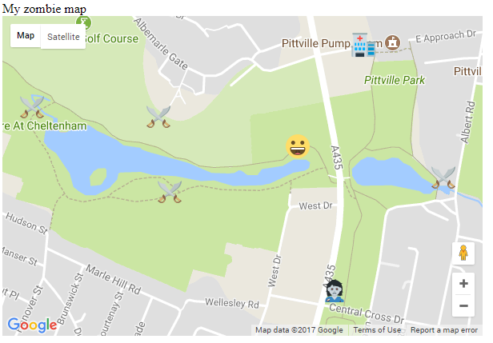

## अपना वर्तमान/मौजूदा स्थान दिखाइए/प्रदर्शित कीजिये

नक्शे पर खिलाड़ी की वर्तमान स्थान प्रदर्शित करते हैं।

+ `initMap()` फ़ंक्शन के अंदर, नक्शा बनाने के बाद, खिलाड़ी का वर्तमान स्थान जानने के लिए HTML5 geolocation का उपयोग करने के लिए कोड जोड़ें:

```javascript
if(navigator.geolocation) {
    navigator.geolocation.watchPosition(set_my_position);
}
else {
    alert("Geolocation doesn't work in your browser");
}
```

यह कोड यह जांचता है कि क्या वेब ब्राउज़र (web browser) का उपयोग करके खिलाड़ी का स्थान पाया जा सकता है या नहीं। यदि यह नहीं मिल सकता है, तो एक संदेश के साथ एक पॉप-अप (pop-up) बॉक्स दिखाई देगा। यदि यह हो सकता है, तो हम यह कोड `watchPosition` को सेट करते है। यह कोड लगातार डिवाइस (device) की स्थान की निगरानी करेगा, और जब भी डिवाइस की स्थान बदलता है, `set_my_position` फ़ंक्शन कॉल हो जाएगा।

+ नक्शे पर खिलाड़ी का स्थान प्रदर्शित करने के लिए, हमें `set_my_position` फंक्शन (function) को परिभाषित करना होगा। `initMap()` फ़ंक्शन के समापन कोष्ठक के बाद, एक `set_my_position` नामक नया फ़ंक्शन बनाएं।

[[[generic-javascript-create-a-function]]]

+ इस फ़ंक्शन को `watchPosition` कमांड (command) द्वारा वर्तमान के अक्षांश (latitude) और देशांतर (longitude) की जरूरत हैं। फंक्शन (function) के कोष्ठक में एक `position` नामक **argument** जोड़े जिससे यह डेटा स्वचालित रूप से उसे दे दिया जाएगा।

`function set_my_position(position){`

+ अक्षांश (latitude) फंक्शन के रूप में इस प्रकार है `position.coords.latitude`, और देशांतर (longitude) इस प्रकार पाया जा सकता है `position.coords.longitude`। उसी प्रक्रिया का पालन करते हुए जैसा कि आपने पिछले चरण में किया था, एक LatLng object बनाएं, `set_my_position` फंक्शन(function) के अंदर, जिसे `pos` कहा जाता है। ऑब्जेक्ट में अक्षांश (latitude) और देशांतर (longitude) के मान होने चाहिए।

```JavaScript
var pos = new google.maps.LatLng(###, ###);
```

+ फ़ंक्शन (function) के अंदर, एक मार्कर (marker) बनाएं जो LatLng ऑब्जेक्ट (object) के स्थान में स्थित होगा। आप उसी तरह से कर सकते हैं जैसे आपने पिछले चरण में मार्कर बनाए थे। हालाँकि, आपको इस मार्कर के लिए एक अलग आइकन( icon) चुनना चाहिए। हमने एक स्माइली चेहरे (smiley face) के रूप में खिलाड़ी का प्रतिनिधित्व किया है, लेकिन आप अपनी पसंद का कोई भी इमोजी (Emoji) चुन सकते हैं। इमोजी इमेज फाइल (emoji image file) उसी फ़ोल्डर में डालना न भूलें, जिसमें आपने `index.html` के कोड को जमा किया है।


+ अपना कोड सेव (save) करें और अपने इंटरनेट ब्राउज़र (internet browser) को रिफ़्रेश (refresh) करें। यदि कोई संदेश यह पूछता है कि क्या ब्राउज़र आपके स्थान के डेटा का उपयोग कर सकता है, तो **Allow** दबाए । आप जहां कहीं भी हो, आपको अपना खिलाड़ी इमोजी (emoji) वहीं दिखाई देना चाहिए।



+ इस चरण पे आप `zoom` को अपने नक्शे पे समायोजित (adjust)) करना पसंद करेंगे यदि कुछ स्थान के आइकन (icons) बहुत दूर दिखाई पड़ रहे हों। बड़े मूल्य का उपयोग करने से नक्शे पर ज़ूम इन (zoom in) हो जाएगा।