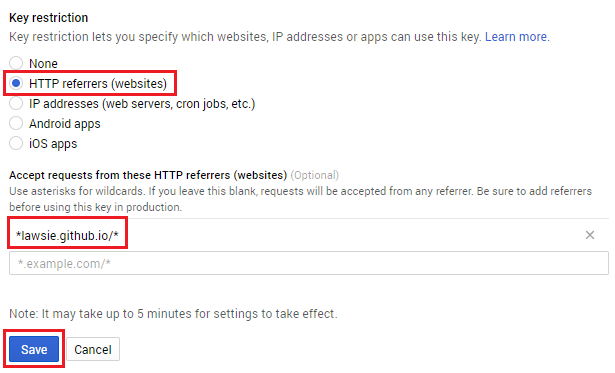

## देखिये यदि जीपीएस (GPS) काम कर रहा है या नही

आप शायद परीक्षण करना पसंद करेंगे कि क्या आपका खिलाड़ी आइकन (icon) आपके के साथ-साथ घूमता है या नहीं, और ऐसा करने के लिए आपको बाहर जाने की जरूरत होगी। कंप्यूटर को पकड़ते समय यह बहुत असुविधाजनक हो सकता है, इसलिए चलो वेब पेज (webpage) को इंटरनेट पर अपलोड (upload) करें ताकि आप इसे अपने फोन (phone) पर चला सकें!

### महत्वपूर्ण सुरक्षा नोट

यह ना भूलें कि जब आप इंटरनेट पर चीजें अपलोड (upload) करते हैं, तो कोई भी उन्हें देख सकता है। यदि आपने नक्शे को अपने घर के अक्षांश और देशांतर (latitude and longitude) पर केंद्रित किया है, तो कोई भी व्यक्ति जो वेब पेज एक्सेस (access) करता है, वह ठीक उसी जगह देख सकता है जहाँ आप रहते हैं। किसी पार्क या शहर के केंद्र जैसे सांप्रदायिक जगह में अपने ज़ौंबीस नक्शे को स्थापित करना अधिक सुरक्षित है ताकि आप अपने व्यक्तिगत डेटा को खतरे में ना डालें।

जीपीएस (GPS) को काम करने के लिए, आपको अपने फ़ोन (Phone) पर स्थान सेवाओं (Location services) को चालू करना होगा। सचेत रहें हो कि इसका मतलब है कि आपका फ़ोन आपकी सही स्थिति को ट्रैक (track) करेगा। इंटरनेट पर अपने सटीक स्थान को सार्वजनिक रूप से पोस्ट (post) करना कभी भी एक अच्छा विचार नहीं है, इसलिए सुरक्षित होने के लिए, स्थान सेवाओं (Location Services) को फिर से बंद कर दें, ज़ौंबीस खेल खेलने के बाद, यह सुनिश्चित करने के लिए कि कोई अन्य ऐप आपके स्थान डेटा का उपयोग नहीं कर सकता है। आपका स्थान केवल आपके द्वारा बनाए गए वेब पेज में ज़ौंबीस गेम द्वारा उपयोग किया जाएगा - आपको पता है कि यह कोड वास्तव में क्या करता है, क्योंकि आपने इसे लिखा था!

### अपना कोड अपलोड (upload) करें

आप अपने ज़ौंबी गेम को किसी भी सेवा पर अपलोड कर सकते हैं जो वेब होस्टिंग (Web hosting) प्रदान करती है। आपके पास पहले से ही कुछ होस्टिंग (hosting) उपलब्ध हो सकती हैं, जिस स्थिति में आप उसका उपयोग कर सकते हैं। हमने [GitHub Pages](https://pages.github.com/){:target="_blank"} का उपयोग किया क्योंकि यह एक भरोसेमंद सेवा है और इस्तेमाल करने में आसान है। इसके साथ आरंभ करने के लिए, इन चरणों का पालन करें:

+ [GitHub account](https://github.com/join){:target="_blank"} का खाता खोलें (sign up)

+ (निर्देश पेज) [Instructions page](https://pages.github.com/){:target="_blank"} पर जाएं, और परियोजना वेबसाइट **(Project site)** पर क्लिक करें और **Start from scratch**

+ इंडेक्स फ़ाइल (index file) बनाने के लिए निर्देशों का पालन करें, लेकिन `<h1>Hello</h1>` टाइप करने के बजाय, अपने `index.html` फाइल से कोड पेस्ट करें, कमिट (commit) करने से पहले।

+ आपको **Upload files** बटन को भी दबाना पड़ेगा और अपनी इमोजी फाइलें (emoji files) अपलोड (upload) करनी पड़ेंगी

+ अंत में, निर्देश के पेज (page) पर चौथे चरण का पालन करे जिससे आपको पता चलेगा की आपके मास्टर ब्रांच (master branch) को GitHub Pages साइट कैसे बनाते है, और फिर अपने पेज को देखने के लिए उसका एड्रेस (address) टाइप कर सकते हैं किसी भी ब्राउज़र (browser) में।

## अपनी API key को प्रतिबंधित करें

अब जब आपने अपना कोड (code) ऑनलाइन डाल दिया है, तो आपकी Google Maps API key सभी को दिखाई दे रही है। कोई इसे ले सकता है और आपकी अनुमति के बिना इसका उपयोग कर सकता है। आप इसे प्रतिबंधित करके ऐसा करने से रोक सकते हैं इसका उपयोग कहाँ कहाँ किया जा सके, ताकि इसका उपयोग केवल आपकी वेबसाइट (website) पर हो।

+ अभी [Google APIs console](https://console.developers.google.com/flows/enableapi?apiid=picker&credential=client_key){:target="_blank"} पर जाएं और **Select a project** पर क्लिक करे, जो पेज के ऊपर के बाए हिस्से में है।

+ उस प्रोजेक्ट (project) को चुने जिसमे आपने अपने API key का इस्तेमाल किया है। इसका नाम अभी भी **My project** होगा अगर आपने इसका नाम नहीं बदला।

+ बाईं ओर पर **Credentials** क्लिक करें, फिर अपनी एपीआई की (API Key) पर क्लिक करें।

+ **Key restriction** के नीचे, **HTTP referrers** को चुने और बॉक्स(box) में, अपनी वेबसाइट की आधार URL जोड़े, `*` के साथ हर छोर पर। उदाहरण के लिए, मेरा कोड `http://lawsie.github.io/` पर होस्ट किया गया था, तो मैंने `*lawsie.github.io/*` जोड़ा। **Save** दबाए।

+ आपकी API Key (एपीआई की) अब केवल आपकी वेबसाइट पर काम करेगी, न कि कहीं और। ध्यान दें कि यदि आप अब अपने कंप्यूटर पर नक्शे को देखने की कोशिश करते हैं, तो यह काम नहीं करेगा क्योंकि वह अनुरोध (request) आपकी वेबसाइट (website) से नहीं आ रहा है। आप एक अतिरिक्त API key (एपीआई की) बनाना चाहते हैं जो अप्रतिबंधित हो, और केवल परीक्षण के लिए अपने निजी कंप्यूटर पर उस key का उपयोग करें।