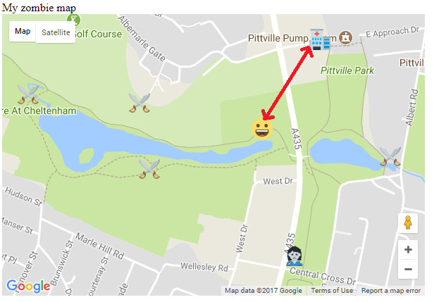

## वस्तुओ को ढूंढिए/खोजिये

अभी हमें खेल को काम करने की आवश्यकता है! जैसे ही खिलाड़ी इधर-उधर घूमेगा, हम जाँचेंगे कि क्या उसे कोई वस्तु मिली है। एक वस्तु खोजने के लिए, उन्हें एक वास्तविक स्थान पर जाना होगा जिसे आभासी वस्तु के स्थान के काफी करीब माना जाता है।

+ `var zombie_map;` पंक्ति का पता लगाएं और, उसके नीचे, एक `tolerance` नामक नया वेरिएबल बनाए। यह वेरिएबल(variable) यह निर्धारित करेगा कि खिलाड़ी को खोजने के लिए आइटम मार्कर के स्थान के कितना करीब होना चाहिए (मीटर में)। आप चुन सकते हैं कि यह कितना करीब है - मीटर की संख्या जितनी कम होगी, खिलाड़ी को वस्तु खोजने के लिए उतनी सटीक स्थान पर पहुंचना होगा। हमने 10 की सहनशीलता (tolerance) चुनी है।

मानचित्र पर दो बिंदुओं के बीच की दूरी की गणना करने में सक्षम होने के लिए, हमें Google की ज्यामिति लाइब्रेरी (Geometry Library) से कुछ तकनीकी विज़ाॆडृ (technical wizardry) का उपयोग करना होगा। पेज (page) के निचले भाग के पास कोड देखें, जो नक्शे को आपकी API key बताता है:

```html
<script async defer
src="https://maps.googleapis.com/maps/api/js?key=A1b2c3d4e5f6g7h8i9j10k11&callback=initMap">
</script>
```

+ ऊपर दिए गए कोड की पंक्ति में, ठीक `initMap` के बाद, पर `"` के अंत के पहले, `&libraries=geometry` जोड़िए। ध्यान रखें की कोड में कोई रिक्त स्थान न छूट जाए।

+ अभी अपने `set_my_position()` फंक्शन में `old_position = marker;` पंक्ति के ठीक नीचे अपना कर्सर (cursor) स्थित करें।

+ एक फॉर लूप (for loop) बनाए जो `all_markers` को बार-बार चलाएगा।

[[[generic-javascript-for-loop-array]]]

+ अपने लूप (loop) के अंदर, निम्न दिए गए कोड का उपयोग करें, वर्तमान स्थिति (`pos`) और मार्कर के बीच के अंतर की गणना करने के लिए, जिसकी हम अभी जांच कर रहे हैं:

```javascript
var distance = google.maps.geometry.spherical.computeDistanceBetween(pos, all_markers[i].getPosition());
```

नीचे दिया गया चित्र, गणना में से एक का उदाहरण दिखाती है। खिलाड़ी और अस्पताल के मार्कर के बीच की दूरी कितनी है?



+ ठीक नीचे एक `if` विवरण जोड़े जो यह जांचता है कि खिलाड़ी और मार्कर के बीच का अंतर जो हम अभी जांच रहे है, वह सहनशीलता से कम है। यह ऐसा दिखाई देना चाहिए:

```javascript
if( distance < tolerance ){
    alert("Found it!")
}
```

फिलहाल हमें यकीन नहीं है कि खिलाड़ी को क्या मिला है।

+ "Found it!" नामक पंक्ति को हटाए, और उसके बदले उस आइकन(icon) का नाम ले जिसके खिलाड़ी करीब हो।

```javascript
var what_is_it = all_markers[i].getIcon();
```

+ `.png` वाला हिस्सा आइकन(icon) के नाम से हटाए। उदाहरण के लिए, यदि आइकन का नाम `hospital.png` है, तो हमे सिर्फ "hospital" कहना है।

```javascript
what_is_it = what_is_it.replace(".png", "");

```

+ खिलाड़ी को यह बताने के लिए अलर्ट (alert) बनाएं कि उन्होंने क्या पाया है। इस संदर्भ में, अलर्ट (alert) यह बताएगा `Found the hospital`:

```javascript
alert("Found the " + what_is_it );
```

+ `all_markers[i]` मार्कर को नक्शे से हटाए, ताकि यह खेल खिलाड़ी को यह बताता न रहे की उन्होंने वहीं वस्तु पाई है।

\--- hints \--- \--- hint \---

याद रखें कि हमने नक्शे से पहले एक मार्कर (marker) हटा दिया था, जब हमने स्माइली (smiley) के हमले को रोक दिया था।

\--- /hint \---

\--- hint \---

नक्शे से मार्कर को हटाने के लिए, मार्कर के नक्शे को `null` पर सेट करें, जिसका मतलब है कि इस मामले में कोई नक्शा नहीं है।

\--- /hint \---

\--- hint \---

आपको `.setMap()` विधि का उपयोग करना होगा मार्कर पर।

\--- /hint \---

\--- /hints \---

+ अंत में, एक अंक जोड़ते हैं। एक बार फिर, इस लाइन का पता लगाएं `var zombie_map;`, और `score` नामक वेरिएबल (variable) बनाने के लिए, कोड की एक और पंक्ति, नीचे जोड़े।

यदि खिलाड़ी को एक ज़ोंबी मिला, तो मेरे खेल में उन्हें कोई अंक नहीं मिलता है। शायद अगर आप विशेष रूप से अपने खिलाड़ी के प्रति कटु महसूस कर रहे हैं तो आप अपने खिलाड़ी को अपने खेल में ऋण अंक दे सकते हैं! अगर उन्हें अस्पताल या हथियार की दुकान मिलती है तो उन्हें 10 अंक मिलते हैं।

+ यहाँ जिस कोड को हम जोड़ना चाहते हैं उसके लिए कुछ सुडो कोड (pseudo code) है। इसे वास्तविक कोड में अनुवादित करें और इसे अपने प्रोग्राम (program) में जोड़ें।

```html
यदि उन्हें को मिला वह ज़ोंबी नहीं है तो
    score + 10 points
    ALERT Your score is + score
```

अपना कोड यहां जोड़ें:


\--- hint \---

\--- hint \---

हमने पहले से ही काम किया है जो उन्होंने पाया है और इसे `what_is_it` वेरिएबल (variable) में सेव (save) कर चुके है। एक शर्त बनाने के लिए इसका उपयोग करें जो यह कहता है की इस वेरिएबल (variable) के अंतर्वस्तु ज़ोंबी के बराबर नहीं (`!=`) है।

\--- /hint \----

\--- hint \---

आप इस तरह एक वेरिएबल (variable) पर अंक जोड़ सकते हैं:

```javascript
score += 10
```

इसका मतलब है "`स्कोर` वही है जो कुछ भी +10 से पहले था "।

\--- /hint \----

\--- hint \---

हल:

```javascript
if( what_is_it != "zombie"){
    score += 10;
    alert("Your score is " + score);
}
```

\--- /hint \----

\--- /hints \---

+ अब यह आपके खेल का परीक्षण करने का समय है! किसी भी परीक्षण को करने से पहले अगले चरण में सुरक्षा युक्तियां दी गई है, उन्हें पढ़ें।