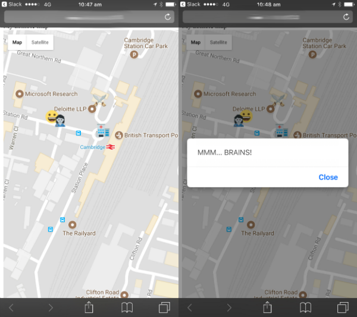

## Introducere

Folosește GPS-ul de pe telefonul tău pentru a crea un joc cu o apocalipsă zombi, pe care îl poți juca în aer liber alături de prietenii tăi. Adună proviziile pentru a căpăta energie, dar evită zombii!

Această resursă presupune ca deja să fi localizat proviziile și zombii folosind resursa [Harta apocalipsei zombi](https://projects.raspberrypi.org/ro-RO/projects/zombie-apocalypse-map){:target="_blank"}.

### Ce vei face

Vei face un joc pe care îl vei putea juca afară folosind funcțiile GPS ale telefonului tău mobil. Găsește proviziile și evită zombii!

### Ce vei învăța

Acest proiect acoperă elemente din următoarele componente ale [Raspberry Pi Digital Making Curriculum](http://rpf.io/curriculum){:target="_blank"}:

+ [Bazele proiectării obiectelor 2D și 3D](https://curriculum.raspberrypi.org/design/creator/)
+ [Aplicarea abstractizării și descompunerii pentru a rezolva problemele mai complexe](https://curriculum.raspberrypi.org/programming/developer/){:target="_blank"}
+ [Implicarea și comunicarea în cadrul comunității de creare digitală](https://curriculum.raspberrypi.org/community-and-sharing/creator/){:target="_blank"}