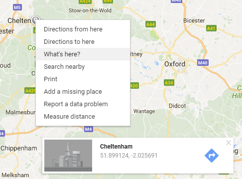

## Creează harta

Dacă deja ai făcut proiectul [Harta de supraviețuire a apocalipsei zombi](https://projects.raspberrypi.org/en/projects/zombie-apocalypse-map){:target="_blank"}, vei observa că primii pași ai acestui proiect sunt foarte asemănători. **Asigură-te că ai deschis un fișier HTML nou pentru acest proiect, în loc să refolosești cod deja existent.** Altfel, s-ar putea să te încurci în etapele care vor urma.

+ Creează și salvează un fișier numit `index.html`. Va trebui să folosești un editor de text de pe calculator, în loc de un editor online de HTML.

[[[generic-html-create-and-save]]]

+ În acest fișier, adaugă etichete pentru a crea o pagina de bază HTML.

[[[generic-html-basic-page]]]

+ Dacă nu ai deja una, obține o cheie API Javascript de la Google Maps. Asigură-te că ai adăugat codul în fișierul tău `index.html` pentru a putea folosi cheia.

[[[generic-api-google-maps-key]]]

+ În editorul de text, găsește eticheta `<head>` din codul tău. Pe o linie nouă goală sub această etichetă, adaugă următorul cod pentru a seta cât de mare va fi harta ta și ce culoare va fi afișată dacă nu se încarcă corect.

```html
<style>
#zombie_map {
    height: 100%;
    width: 100%;
    left: 0;
    position: absolute;
    top: 0;  
    background-color: grey;
}
</style>
```

+ Localizează eticheta `<body>` din codul tău. Pe o nouă linie goală sub această etichetă, adaugă următorul cod pentru a crea `<div>` (o casetă invizibilă) unde harta ta va apărea, în cele din urmă.

```html
Harta mea zombi
<div id="zombie_map"></div>
```

+ Localizează un oraș pe [Google Maps](http://maps.google.com){:target="_blank"}, apoi fă click dreapta pe hartă și selectează **Ce e aici?**. O casetă care indică latitudinea și longitudinea va apărea în partea de jos a paginii.



+ Imediat sub codul `<div>` pe care doar ce l-ai adăugat, insereaza următorul cod pentru a crea harta. Înlocuiește părțile `###` cu valorile latitudinii și longitudinii pe care doar ce le-ai aflat pentru orașul tău.

```html
<script>
    var zombie_map;
    function initMap() {

            zombie_map = new google.maps.Map(document.getElementById('zombie_map'), {
            zoom: 10,
            center: {lat: ###, lng: ###}
        });
    }
</script>
```

+ Salvează-ți codul și reîncarcă browser-ul. Ar trebui să vezi o hartă Google a orașului pe care l-ai ales în centrul hărții.

