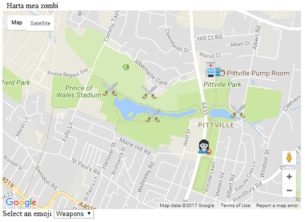

## Obține datele marcajului

+ Poți decide unde vor fi punctele tale de interes prin crearea unei [Hărți de supraviețuire a apocalipsei zombie](https://projects.raspberrypi.org/en/projects/zombie-apocalypse-map){:target="_blank"}. Aici este un exemplu de hartă pe care am creat-o pentru un joc de zombie în parcul local. Datele pentru această hartă au fost copiate din **consolă**.



```html
51.90769026213801 -2.068905830383301 zombie.png
51.91174087287536 -2.0681333541870117 hospital.png
51.91054955470073 -2.0736265182495117 weapons.png
51.909305255309874 -2.0733261108398438 weapons.png
51.91070839895001 -2.077016830444336 weapons.png
51.90954352807475 -2.0659875869750977 weapons.png
```

+ De asemenea, va trebui să copiezi fișierele emoji pe care le-ai folosit când ai creat harta, și să le lipești în același folder în care se află și fișierul `index.html` al jocului tău. Noi am folosit următoarele emoji-uri, dar poți să-ți alegi altele pentru harta ta.   

+ Localizează linia de cod `var zombie_map;`. Sub ea, pe o linie goală, creează o noua variabilă numită `data`, și seteaz-o egală cu datele pe care le-ai copiat din consolă. Lipirea datelor poate face ca editorul tău să se plângă și să evidențieze liniile de cod într-un mod ciudat, așa că pune un backtick (\`) la începutul și la sfârșitul datelor pe care le-ai lipit. Acest lucru îi va spune lui JavaScript că ceea ce ați lipit este un șir împărțit pe mai multe linii.

[[[generic-javascript-create-variable]]]

+ Vrem să ne ocupăm de fiecare marcaj separat, așa că hai să adăugam niște cod pe următoarea linie pentru a împărți datele pe linii separate. Fiecare linie individuală reprezintă date pentru un marcaj, așa că vom împărți datele oriunde caracterul invizibil pentru o noua linie `\n` este detectat.

```JavaScript
var markers = data.split("\n");
```

[[[generic-javascript-split-string]]]

Obținem un **tablou de date** care conține datele marcajelor pe care le vom pune pe hartă în următorul pas.

## \--- collapse \---

## title: Rezultatul final

```JavaScript
var data = `51.90769026213801 -2.068905830383301 zombie.png
51.91174087287536 -2.0681333541870117 hospital.png
51.91054955470073 -2.0736265182495117 weapons.png
51.909305255309874 -2.0733261108398438 weapons.png
51.91070839895001 -2.077016830444336 weapons.png
51.90954352807475 -2.0659875869750977 weapons.png`;
var markers = data.split("\n");
```

\--- /collapse \---