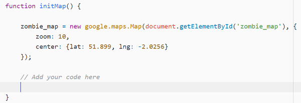

## Creează marcajele

+ Sub linia `var harta_zombi;`, adaugă o altă linie pentru a crea o variabilă numită `toate_markerele`. Seteaz-o egală cu `[]`, care reprezintă un tablou gol. Acest lucru va stoca, în final, o referință la fiecare dintre marcajele pe care suntem pe cale sa le creăm.

+ Poziționează cursorul în interiorul funcției `initHarta()`, chiar sub codul pentru crearea hărții zombi.



+ Creează o buclă for care va rula o dată pentru fiecare marcaj din tabloul `marcaje` pe care l-am creat în pasul anterior.

[[[generic-javascript-for-loop-array]]]

În interiorul buclei for, linia de date a marcajului la care ne uităm în momentul de față este `marcaje[i]` - bucla va adăuga `1` la variabila `i` de fiecare dată când rulează, așa că ne vom uita la fiecare linie de date, una câte una.

Prima linie de date arată astfel:

```html
51.90769026213801 -2.068905830383301 zombie.png
```

Vrem să obținem aceste date într-un tablou, așa că va trebui să le împărțim la fel ca în pasul anterior.

+ Adaugă toate celelalte linii de cod în acest pas în bucla for. Mai întâi, cu ajutorul funcției `trim()` elimină orice spații nedorite de la începutul și sfârșitul datelor, făcând în felul următor:

```JavaScript
var date_marcaje = marcaje[i].trim();
```

+ Acum, împarte șirul la fel ca și înainte, dar de data aceasta împarte oriunde există un spațiu:

```JavaScript
date_marcaje = date_marcaje.split(" ");
```

Dacă faci așa, vei obține un tablou numit `date_marcaje`, care conține trei valori. În ordine, acestea sunt: latitudinea, longitudinea și fișierul de imagine al marcajului.

+ Creează variabile pentru a denumi fiecare dintre aceste valori. Am numit prima variabila pentru tine:

```JavaScript
var latitudine = date_marcaje[0];
var longitudine = ?;
var emoji = ?;
```

+ Pentru a putea adăuga marcajul la poziția corectă, trebuie să creezi un obiect `LatLng`.

```JavaScript
var pozitie_marcaje = new google.maps.LatLng(###, ###);
```

Adaugă această linie de cod imediat sub linia anterioară, înlocuind `###` cu variabilele de latitudine și longitudine.

+ Tot în interiorul buclei, scrie un cod pentru a crea un marcaj la poziția `pozitie_marcaje`, cu pictograma `icon:` setată cu variabila emoji.

[[[generic-api-google-maps-marker]]]

\--- hints \--- \--- hint \--- În loc să pui o latitudine/longitudine fixă ca în exemplu, folosește variabila `pozitie_marcaje` pentru a spune marcajului unde trebuie plasat. \--- /hint \---

\--- hint \--- Verifică dacă numele hărții (în exemplul `hartamea`) este identic cu numele hărții pe care ai creat-o. \--- /hint \---

\--- hint \--- Poți adăuga o pictogramă adăugând o altă linie în marcaj pentru a specifica `icon: "numeleimaginii.png"`. Don't forget to put a comma at the end of the `map` line to indicate that there is another marker property you would like to set. \--- /hint \---

\--- hint \--- If you specify a fixed file name like `nameofpicture.png`, then the marker icon will always be the same. We created a variable earlier which contains the picture name: put the variable `emoji` as the specified icon to use the right emoji from the data.

```JavaScript
var marker = new google.maps.Marker({
  position: marker_position,
  map: zombie_map,
  icon: emoji
});
```

\--- /hint \---

\--- /hints \---

+ Immediately after the end of the `marker` code, but still within the loop, add the following line to save a reference to this marker in our list of `all_markers`. We will need this list in a later step.

```JavaScript
all_markers.push(marker);
```

+ Save your code and refresh the page. Test that all of your markers show up on the map. If they do not show up properly, perhaps you could look in the JavaScript **console** to see if there are any error messages for you to resolve?

[[[generic-javascript-opening-console]]]