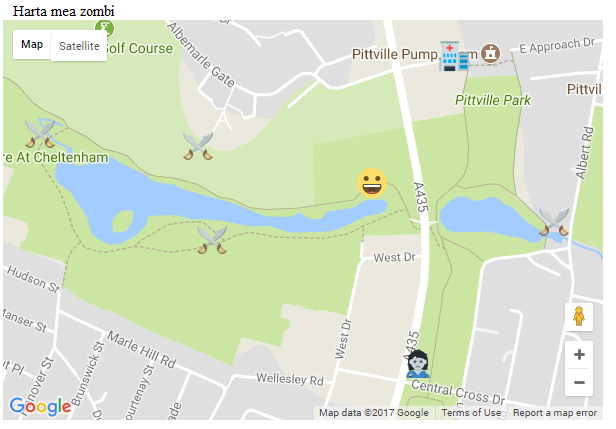

## Afișează poziția ta curentă

Să afișăm poziția curentă a jucătorului pe hartă.

+ În interiorul funcției `initHarta()`, după ce creezi harta, adaugă niște cod pentru a utiliza geolocalizarea HTML5 pentru a găsi poziția curentă a jucătorului:

```javascript
if(navigator.geolocation) {
    navigator.geolocation.watchPosition(set_my_position);
}
else {
    alert("Geolocalizarea nu functioneaza in browser-ul tau");
}
```

Acest cod verifică dacă locația jucătorului poate fi găsită folosind browserul web. Dacă nu poate fi găsită, va apărea o fereastră pop-up cu un mesaj. Dacă poate fi găsită, setăm codul pentru `watchPosition`. Acest cod va monitoriza constant poziția dispozitivului și va apela funcția `set_my_position` ori de câte ori poziția dispozitivului se schimbă.

+ Pentru a putea afișa poziția jucătorului pe hartă, trebuie să scriem funcția `set_my_position`. După paranteza de închidere a funcției `initMap()`, creează o nouă funcție numită `set_my_position`.

[[[generic-javascript-create-a-function]]]

+ Această funcție are nevoie de latitudinea și longitudinea curente prin comanda `watchPosition` pe care am setat-o. Adaugă un **argument** numit `position` în parantezele funcției, astfel încât aceste date să fie transmise automat la aceasta.

`function set_my_position(position){`

+ Latitudinea poate fi găsită în funcția `position.coords.latitude` și longitudinea în `position.coords.longitude`. Urmând același proces ca și în pasul precedent, creează un obiect LatLng numit `pos` în interiorul funcției `set_my_position`. Obiectul trebuie să conțină valorile latitudinii și longitudinii.

```JavaScript
var pos = new google.maps.LatLng(###, ###);
```

+ Tot în interiorul funcției, creează un marcaj care se află la poziția obiectului LatLng. Poți face acest lucru la fel cum ai creat marcajele în pasul anterior. Cu toate acestea, ar trebui să alegi o pictogramă diferită pentru acest marcaj. Am ales să reprezentăm jucătorul cu un chip zâmbăreț, dar poți alege orice emoji care îți place. Nu uita să copiezi și să lipești fișierul cu imaginea emoji pe care dorești să o utilizezi în același folder în care se află codul `index.html`.


+ Salvează-ți codul și reîncarcă-ți browser-ul. Dacă apare un mesaj care te întreabă dacă browser-ul îți poate folosi datele de locație, apasă **Permite**. Ar trebui să vezi emoji-ul jucătorului tău în locul în care te afli.



+ Poate dorești să reglezi valorea `zoom` de pe harta ta în acest moment, dacă este setat prea departe pentru ca locațiile pictogramelor sa se poată vedea clar. Utilizarea unei valori mai mari ajută la mărirea vizualizării pe hartă.