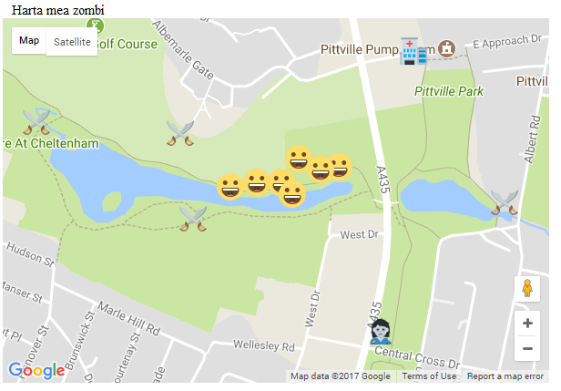

## Atacul emoji-urilor zâmbărețe

Când ai testat harta pe telefon, probabil ai crezut că ești atacat de emoji-uri zâmbărețe, mai degrabă decât de zombi! Acest lucru se datorează faptului că pagina creează un marker nou de fiecare dată când jucătorul se mișcă, dar nu elimină marcajele pozițiilor anterioare. În cele din urmă, acest lucru devine într-adevăr confuz, pentru că nu poți să-ți dai seama unde ești si unde ai fost!



Continuă să editezi codul pe computer. Poți încărca din nou codul pe GitHub dacă dorești să îl testezi în exterior.

+ Localizează linia `var harta_zombi;`, iar sub aceasta adaugă o nouă variabilă numită `pozitie_veche`.

+ În interiorul funcției `initHarta()`, creează un marcaj numit `pozitie_veche` în aceeași locație în care ai centrat harta când ai creat-o. (De fapt, nu contează la ce locație este inițializat acest marcaj, deoarece valoarea locației sale va fi suprascrisă aproape imediat, dar ea trebuie inițializată. Doar am folosit locația centrală a hărții, deoarece a fost la îndemână!)

+ Localizează funcția `seteaza_pozitia_mea()`. Adaugă o linie de cod pentru ca **primul lucru** pe care îl face funcția este să elimine vechea poziție a marcajului de pe hartă. `null` este un cuvânt cheie special care în acest caz înseamnă „fără hartă”.

```JavaScript
pozitie_veche.setMap(null);
```

+ Adaugă o altă linie de cod la funcția `seteaza_pozitia_mea()`, dar de data aceasta ar trebui să fie **ultimul** lucru pe care îl face funcția. Acesta salvează noua poziție a marcajului pe care tocmai l-ai creat ca `pozitie_veche`, astfel încât data viitoare când creăm un marcaj nou, știm unde era cel anterior.

```JavaScript
pozitie_veche = marcaj;
```

+ Salvează-ți codul și încărcați-l din nou pe serviciul de găzduire web. Testează-ți codul mergând pe jos. Ar trebui să vezi emoji-ul zâmbăreț atașat jucătorului tău mișcându-se, dar de această dată nu va mai exista nicio urmă de zâmbete, ci un singur marcaj care să îți arate poziția actuală. Yay!