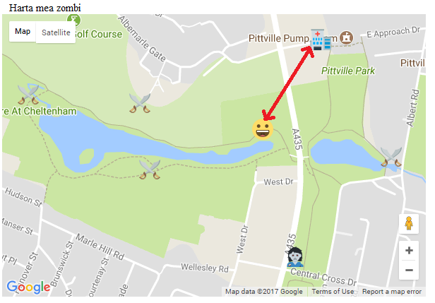

## Găsește obiectele

Acum trebuie să facem jocul să funcționeze! Pe măsură ce jucătorul se mișcă, vom verifica dacă acesta a găsit un obiect. Pentru a găsi un obiect, trebuie să meargă într-o locație din viața reală care este considerată suficient de aproape de locația virtuală a obiectului.

+ Localizează linia `var harta_zombi;`, iar sub aceasta adaugă o nouă variabilă numită `toleranta`. Această variabilă va determina cât de aproape va trebui să fie jucătorul de locația marcajului pentru obiectul respectiv (în metri) pentru a-l găsi. Poți alege cât de aproape este acest obiect - cu cât numărul de metri este mai mic, cu atât mai aproape de locația exactă jucătorul va trebui să ajungă pentru a găsi obiectul. Am ales o toleranță de 10.

Pentru a putea calcula distanța dintre două puncte de pe o hartă, trebuie să folosim o parte din vrăjitoriile tehnice ale Google din biblioteca lor de geometrie. Găsește codul în partea de jos a paginii care ii îndică hărții cheia ta API:

```html
<script async defer
src="https://maps.googleapis.com/maps/api/js?key=A1b2c3d4e5f6g7h8i9j10k11&callback=initMap">
</script>
```

+ În linia de cod de mai sus, imediat după `initHarta`, dar înainte de încheierea `"`, adaugă `&libraries=geometry`. Ai grijă să nu adăugi spații.

+ Acum localizează funcția `seteaza_pozitia_mea()` și poziționează cursorul imediat sub linia `pozitie_veche = marcaj;`.

+ Creează o buclă care va trece prin tabloul `toate_marcajele`.

[[[generic-javascript-for-loop-array]]]

+ În interiorul buclei, utilizează următorul cod pentru a calcula distanța dintre poziția curentă (`poz`) și marcajul pe care îl examinăm în momentul de față:

```javascript
var distanta = google.maps.geometry.spherical.computeDistanceBetween(poz, toate_marcajele[i].getPosition());
```

Imaginea de mai jos arată un exemplu de calcul. Cât de departe este jucătorul față de marcajul spitalului?



+ Add an `if` statement immediately below to check whether the distance between the player and the marker we are currently examining is less than the tolerance. It should look like this:

```javascript
if( distance < tolerance ){
    alert("Found it!")
}
```

At the moment we are not sure what it is the player has found.

+ Remove the line saying "Found it!", and instead get the name of the icon the player is close to.

```javascript
var what_is_it = all_markers[i].getIcon();
```

+ Remove the `.png` part from the name of the icon. For example, if the icon's name is `hospital.png`, we just want to say "hospital".

```javascript
what_is_it = what_is_it.replace(".png", "");

```

+ Create an alert to tell the player what they have found. In this case, the alert will say `Found the hospital`:

```javascript
alert("Found the " + what_is_it );
```

+ Remove the `all_markers[i]` marker from the map, so that the game does not keep telling the player they found the same thing.

\--- hints \--- \--- hint \--- Remember that we removed a marker from the map before, when we stopped the attack of the smileys. \--- /hint \---

\--- hint \--- To remove a marker from the map, set the map of the marker to `null`, which means no map in this case. \--- /hint \---

\--- hint \--- You will need to use the `.setMap()` method on the marker. \--- /hint \---

\--- /hints \---

+ Finally, let's add a score. Once again, locate the line `var zombie_map;`, and add another line of code below it to create a variable called `score`.

If the player found a zombie, in my game they don't get any points. Perhaps if you are feeling particularly mean you could give your player minus points in your game! If they found a hospital or a weapon store they get 10 points.

+ Here is some pseudo code for the code we want to add. Translate it into real code and add it to your program.

```html
IF what they found isn't a zombie
    score + 10 points
    ALERT Your score is + score
```

Add your code here:


\--- hints \---

\--- hint \--- We already worked out what they found and stored it in the variable `what_is_it`. Use this to create a condition which says that the contents of this variable is not equal to (`!=`) zombie. \--- /hint \----

\--- hint \--- You can add on points to a variable like this:

```javascript
score += 10
```

This means "`score` is whatever it was before plus 10". \--- /hint \----

\--- hint \--- Solution:

```javascript
if( what_is_it != "zombie"){
    score += 10;
    alert("Your score is " + score);
}
```

\--- /hint \----

\--- /hints \---

+ Now it's time to test out your game! Have a read through the safety tips in the next step before you do any testing.