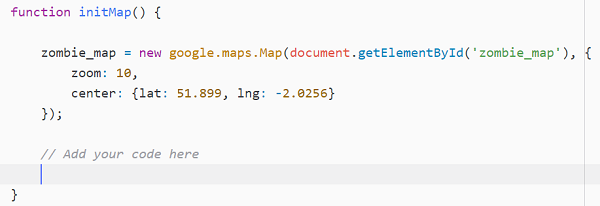

## Create the markers

+ Below the line `var zombie_map;`, add another line to create a variable called `all_markers`. Set it equal to `[]`, which is a blank array. This will eventually store a reference to each of the markers we are about to create.

+ Position your cursor inside the `initMap()` function, just below the code for creating the zombie map.



+ Create a for loop that will run once for every marker in the `markers` array we created in the previous step.

[[[generic-javascript-for-loop-array]]]

Inside the for loop, the line of marker data we are currently looking at is `markers[i]` - the loop will add `1` to the variable `i` each time it runs, so we will be looking at each line of data, one by one.

The first line of data looks like this:

```html
51.90769026213801 -2.068905830383301 zombie.png
```

We want to end up with this data as an array, so we will need to split it up just like we did in the previous step.

+ Add all the other lines of code in this step inside your for loop. First, `trim()` any unwanted spaces from the beginning and end of the data, like so:

```JavaScript
var marker_data = markers[i].trim();
```

+ Now split the string up just like we did before, but this time split wherever there is a space:

```JavaScript
marker_data = marker_data.split(" ");
```

Doing so will give you an array called `marker_data`, which contains three values. In order, these are: the latitude, the longitude, and the marker image file.

+ Create variables to name each of these values. We've done the first for you:

```JavaScript
var latitude = marker_data[0];
var longitude = ?;
var emoji = ?;
```

+ To be able to add the marker at the correct position, you need to create a `LatLng` object.

```JavaScript
var marker_position = new google.maps.LatLng(###, ###);
```

Add this line of code immediately below the previous line, replacing `###` with the latitude and longitude variables.

+ Still inside the loop, write some code to create a marker at the `marker_position`, with the `icon:` set to the emoji variable.

[[[generic-api-google-maps-marker]]]

\--- hints \--- \--- hint \--- Instead of putting in a fixed latitude/longitude like in the example, use the `marker_position` variable to tell the marker where it should be placed. \--- /hint \---

\--- hint \--- Check that the name of the map (in the example `mymap`) is the same as the name of the map you have created. \--- /hint \---

\--- hint \--- You can add an icon by adding another line within the marker to specify `icon: "nameofpicture.png"`. Don't forget to put a comma at the end of the `map` line to indicate that there is another marker property you would like to set. \--- /hint \---

\--- hint \--- If you specify a fixed file name like `nameofpicture.png`, then the marker icon will always be the same. We created a variable earlier which contains the picture name: put the variable `emoji` as the specified icon to use the right emoji from the data.

```JavaScript
var marker = new google.maps.Marker({
  position: marker_position,
  map: zombie_map,
  icon: emoji
});
```

\--- /hint \---

\--- /hints \---

+ Immediately after the end of the `marker` code, but still within the loop, add the following line to save a reference to this marker in our list of `all_markers`. We will need this list in a later step.

```JavaScript
all_markers.push(marker);
```

+ Save your code and refresh the page. Test that all of your markers show up on the map. If they do not show up properly, perhaps you could look in the JavaScript **console** to see if there are any error messages for you to resolve?

[[[generic-javascript-opening-console]]]